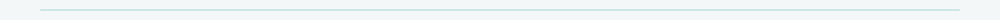
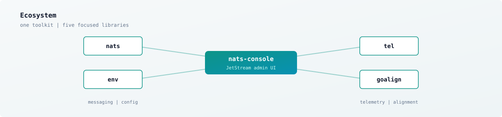
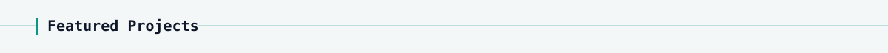
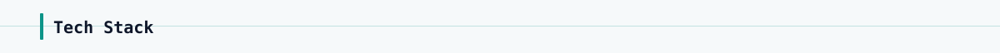
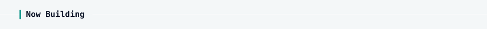

<picture>
  <source media="(prefers-color-scheme: dark)" srcset="assets/dark/header.svg"/>
  
</picture>

Building clean, fast Go systems around **NATS**, observability, and developer tooling.

Practical software: clear APIs, strong docs, and production-ready defaults.

  
  
  
  
  
  

<picture>
  <source media="(prefers-color-scheme: dark)" srcset="assets/dark/divider.svg"/>
  
</picture>

<picture>
  <source media="(prefers-color-scheme: dark)" srcset="assets/dark/ecosystem.svg"/>
  
</picture>

<picture>
  <source media="(prefers-color-scheme: dark)" srcset="assets/dark/section-projects.svg"/>
  
</picture>

## Featured Projects

| | Repository | What it does | Stack |
| :---: | --- | --- | --- |
| ★ | [`nats-console`](https://github.com/gopherust-io/nats-console) | Self-hosted JetStream console with multi-cluster UX | Go · TS · Postgres |
| | [`env`](https://github.com/gopherust-io/env) | Zero-alloc env config via compile-time codegen | Go · codegen |
| | [`goalign`](https://github.com/gopherust-io/goalign) | Detect and fix Go struct memory alignment | Go · CLI |
| | [`nats`](https://github.com/gopherust-io/nats) | Opinionated JetStream patterns for reliable services | Go · NATS |
| | [`tel`](https://github.com/gopherust-io/tel) | Allocation-sensitive OTLP metrics and traces | Go · OTel |

<picture>
  <source media="(prefers-color-scheme: dark)" srcset="assets/dark/section-stack.svg"/>
  
</picture>

## Tech Stack

  
  
  
  
  
  
  

<picture>
  <source media="(prefers-color-scheme: dark)" srcset="assets/dark/section-now.svg"/>
  
</picture>

## Now Building

- Polishing docs and developer experience across the core toolkit
- Hardening CI, security, and release workflows for consistency

  <picture>
    <source media="(prefers-color-scheme: dark)" srcset="https://github-readme-stats-anuraghazra1.vercel.app/api?username=gopherust-io&amp;show_icons=true&amp;theme=dark&amp;hide_border=true&amp;title_color=2dd4bf&amp;icon_color=2dd4bf&amp;text_color=e2e8f0&amp;bg_color=0d1117"/>
    
  </picture>
    
  <strong>Connect</strong> · <a href="https://github.com/gopherust-io">github.com/gopherust-io</a>

